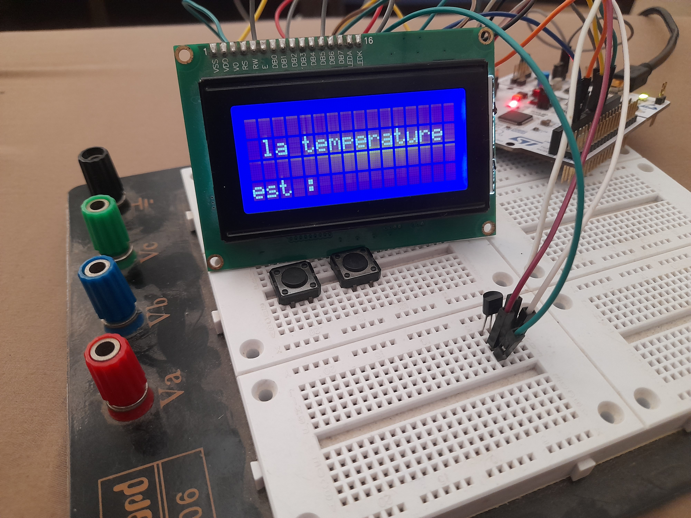

# **🌡️ Contrôle et Affichage de la Température avec STM32F4, LM35 et LCD**

## **📖 Description**
Ce projet consiste à concevoir un système embarqué capable de mesurer et d'afficher la température ambiante en temps réel. Utilisant un microcontrôleur **STM32F446RE**, un capteur de température **LM35**, et un écran LCD, ce projet met en avant une solution fiable et efficace pour le suivi des variations thermiques.

---

## **🎯 Objectifs du Projet**
- Lire la température ambiante avec le capteur analogique **LM35**.
- Convertir les données analogiques en numérique grâce à l'ADC (Convertisseur Analogique-Numérique) intégré au **STM32F446RE**.
- Afficher les résultats en temps réel sur un écran **LCD**.


---

## **⚙️ Composants Matériels**
- **Microcontrôleur** : STM32F4 (STM32F446RE)
- **Capteur de température** : LM35
- **Écran** : LCD standard (16x2) 
- **Connecteurs et câblage** : Pour les connexions.

---

## **🖥️ Outils et Environnement**
- **IDE** : STM32CubeIDE
- **Bibliothèques** : HAL (Hardware Abstraction Layer) pour STM32
- **Langage** : C

---

## **📸 Aperçu**
Voici un aperçu du système en action :  



---

## **📂 Structure du Projet**
- **Core/** : Contient le code source principal et les configurations STM32.
- **Drivers/** : Bibliothèques HAL pour gérer les périphériques.

---

## **🚀 Fonctionnalités**
1. Lecture précise de la température en degrés Celsius.
2. Affichage clair et lisible sur un écran LCD.
3. Réponse rapide grâce aux performances du microcontrôleur STM32F446RE.

---

## **🔧 Connexions Matérielles**
- **LM35** :
  - VCC → 3.3V
  - GND → GND
  - OUT → PA0 (ADC_IN0 sur STM32)
- **LCD** (Mode 4 bits) :
  - RS, E, D4-D7 connectés aux GPIO de l'**STM32F4**.

---

## **📜 Instructions d'Utilisation**
1. Cloner ce dépôt :  
   ```bash
   git clone https://github.com/hazemboukouba/Controle-et-Affichage-de-la-temperature_stm32f4-Lm35-lcd.git
2. Ouvrir le projet dans STM32CubeIDE.
3. Compiler et flasher le firmware sur le STM32F446RE.
4. Connecter le matériel conformément au schéma.
5. Alimenter le système et observer les données affichées sur le LCD.

## 🎉 Auteur

Hazem BOUKOUBA - Ingénieur en systèmes embarqués passionné.
📧 Contact : www.linkedin.com/in/boukouba-hazem
